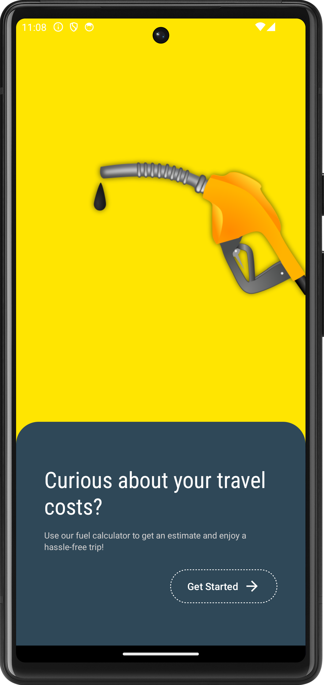
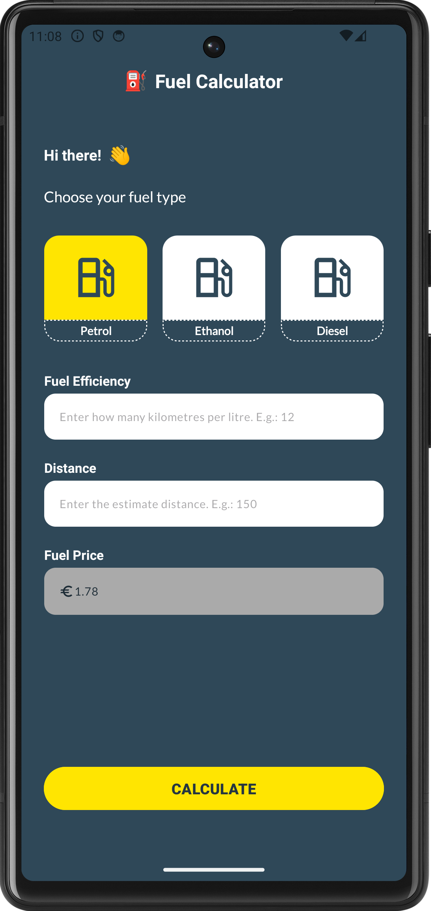
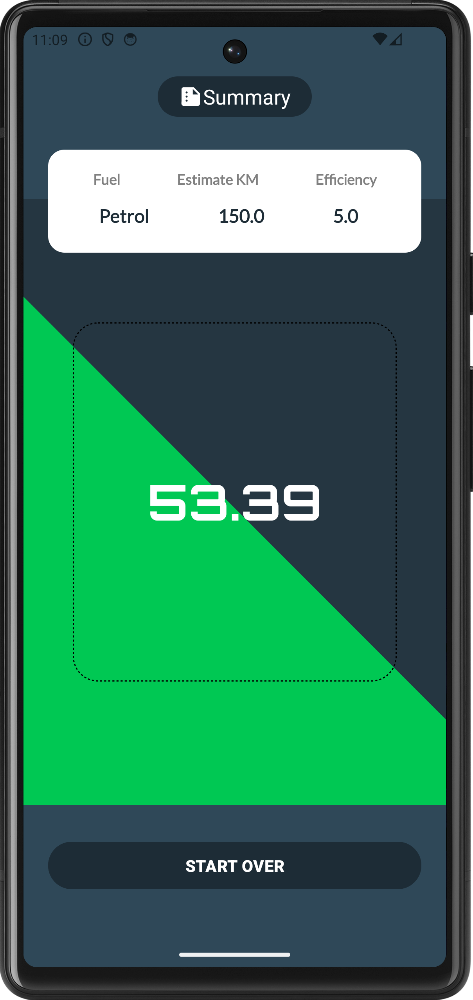

# Fuel Calculator

## Project Description

This project is an Android native app developed in Kotlin, The Fuel Calculator app, developed in Kotlin, is a user-friendly mobile application designed to help users accurately calculate their fuel consumption and expenses. By selecting the fuel type, entering their vehicle's fuel efficiency, and estimating the travel distance, users can easily determine the amount of fuel needed and the total cost for their journey.

## Key Features

1. Fuel type selection:
   Users can choose between three types of fuel: Petrol ⛽, Ethanol 🍃 and Diesel 🚛. Each fuel type is represented by a clear and distinct icon for easy identification.

2. Fuel efficiency input:
   The app allows users to enter their vehicle's fuel efficiency in kilometres per litre. This input ensures personalised and accurate calculations based on the specific performance of the user's vehicle. 🚗📊

3. Distance input:
   Users can enter the estimated distance of the journey in kilometres. This feature helps calculate the total fuel required for a given journey. 📍📏

4. Fuel price entry:
   The fuel price is determined automatically based on the type of fuel selected. 💰⛽

5. User-Friendly Interface: The app is designed with a clean and intuitive interface, making it easy for users to input their data and understand their Fuel efficiency results.

## Technical Details:

- **Programming Language**: Kotlin
- **Development Environment**: Android Studio
- **Custom Drawables**: The app uses custom drawable resources for the SeekBar thumb and other UI elements.


## :camera_flash: Screenshots
<!-- You can add more screenshots here if you like -->

<div class="flex">
   
   
   
</div>

## Technologies

- Activity
- intent
- Snackbar
- ViewGroups
    - Linear Layouts
    - Constraints Layouts
    - Guidelines
- Views
    - ImageView
    - TextView
    - EditText
    - Buttons

## License

```
The MIT License (MIT)

Copyright (c) 2024 Emidio Valereto Neto

Permission is hereby granted, free of charge, to any person obtaining a copy of
this software and associated documentation files (the "Software"), to deal in
the Software without restriction, including without limitation the rights to
use, copy, modify, merge, publish, distribute, sublicense, and/or sell copies of
the Software, and to permit persons to whom the Software is furnished to do so,
subject to the following conditions:

The above copyright notice and this permission notice shall be included in all
copies or substantial portions of the Software.

THE SOFTWARE IS PROVIDED "AS IS", WITHOUT WARRANTY OF ANY KIND, EXPRESS OR
IMPLIED, INCLUDING BUT NOT LIMITED TO THE WARRANTIES OF MERCHANTABILITY, FITNESS
FOR A PARTICULAR PURPOSE AND NONINFRINGEMENT. IN NO EVENT SHALL THE AUTHORS OR
COPYRIGHT HOLDERS BE LIABLE FOR ANY CLAIM, DAMAGES OR OTHER LIABILITY, WHETHER
IN AN ACTION OF CONTRACT, TORT OR OTHERWISE, ARISING FROM, OUT OF OR IN
CONNECTION WITH THE SOFTWARE OR THE USE OR OTHER DEALINGS IN THE SOFTWARE.
```
